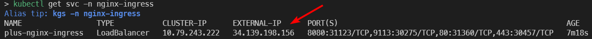
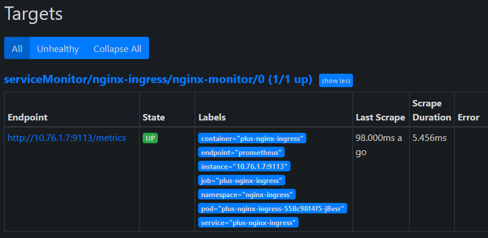
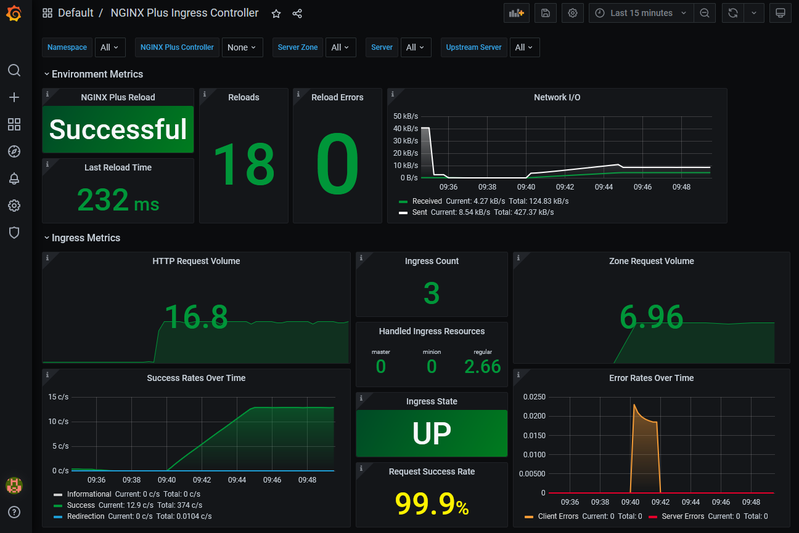
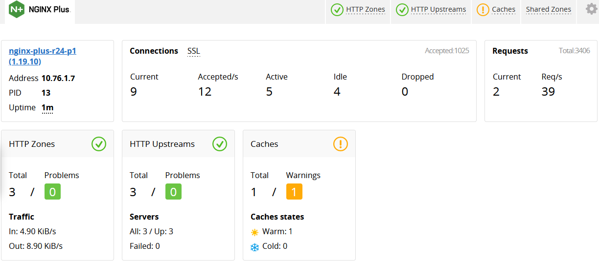

# monitoring-nginx-plus-ingress

Easily create metrics monitoring for NGINX Plus Ingress Controller using the Prometheus Operator and Grafana. There are many excellent tools out there, this is just an example.

This repo uses a real DNS domain name hosted in GCP DNS. You can also use host files.

## Installation

1. Create a cluster, I use gke:

```shell
gcloud container clusters create jesse-gke4 --num-nodes=1 --zone=us-east1
```

1. Install the Ingress Controller:

    ```shell
    helm repo add nginx-stable https://helm.nginx.com/stable
    helm repo update
    helm install -n nginx-ingress plus nginx-stable/nginx-ingress -f nginx-helm/values-plus.yaml --create-namespace
    ```

1. Edit the [prometheus-ingress.yaml](prometheus-ingress.yaml) and [grafana-ingress.yaml](grafana-ingress.yaml) host names to match.

1. Wait for the LoadBalancer IP to be configured:

    ```shell
    kubectl get svc -n nginx-ingress --watch
    ```

    

1. Create a wildcard dns entry with the External-IP:

    ```shell
    gcloud dns record-sets create '*.k4.nginx.rocks' --rrdatas=34.139.198.156 --type=A --ttl=60 --zone=nginx-rocks
    ```

1. Edit the [prometheus-ingress.yaml](prometheus-ingress.yaml) and [grafana-ingress.yaml](grafana-ingress.yaml) host names to match.

1. Apply the prometheus operator bundle <https://github.com/prometheus-operator/prometheus-operator#quickstart>

    ```shell
    kubectl apply -n default -f default-namespace/prometheus-operator-bundle.yaml
    ```

1. Apply the yaml files in the root of this repo:

    ```shell
    kubectl apply -n nginx-ingress -f .
    ```

1. Watch the pods progress (Ready # matches /#):

    ```shell
    kubectl get pods -n nginx-ingress --watch
    ```

1. View the prometheus targets: <http://prom.k4.nginx.rocks/targets>
    

1. Scale the ingress deployment to 3 pods and refresh the targets web page:

    ```shell
    kubectl scale deployment -n nginx-ingress plus-nginx-ingress --replicas 3
    ```

    *Note that it will take a moment for Prometheus to pickup the new pods.*

1. View the Grafana Dashboard (admin/admin) <http://grafana.k4.nginx.rocks/d/VUwGrLVMz/nginx-plus-ingress-controller?orgId=1>

    

1. View the NGINX Plus real-time dashboard: <http://dashboard.k4.nginx.rocks/dashboard.html>

    
